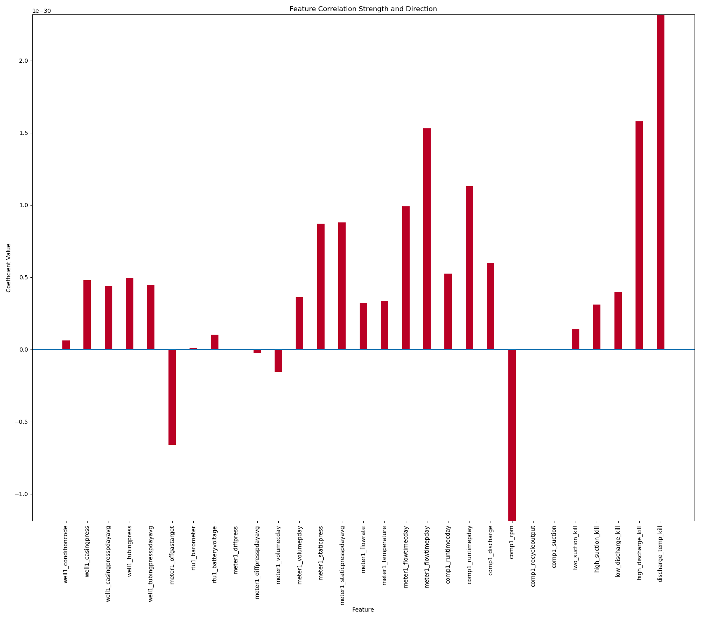

# CompressorFailure

Predicting compressor failure through a variety of features.

Attempting to determine if certain compressors are more likely to fail. Determining
the overall cost/benefit based on upfront expense along with mainenance and
failure frequency.

Initial analysis has proven that there is a correlation between the make and model
of a compressor and how likely it is to fail. We are looking to investigate this
further to see if certain compressors are operating outside of the recommended
specifications. There also may be significance in the maintenance schedule.

Pulling data from the RTR database, we are able to achieve very high accuracies
due to unbalanced classes. We have chosen to oversample the minority class along
with increasing the rate of that class (positive class == failure). The response
variable is whether or not a compressor will fail in the next X days. Initial
model building has been based around predicting either 7 or 3 days out. Best
results have come from building a random forest classifier. A logistic regression
model has been trained as well in order to learn feature importance.

### Feature Importance

Looking at the coefficients from the logistic regression, we can see that some
features are clearly the more influential than others when predicting failures.
The top feature (days since last failure) has been engineered from the data
acquired but is left out of the graph below due to it's dramatically higher
coefficient value.

